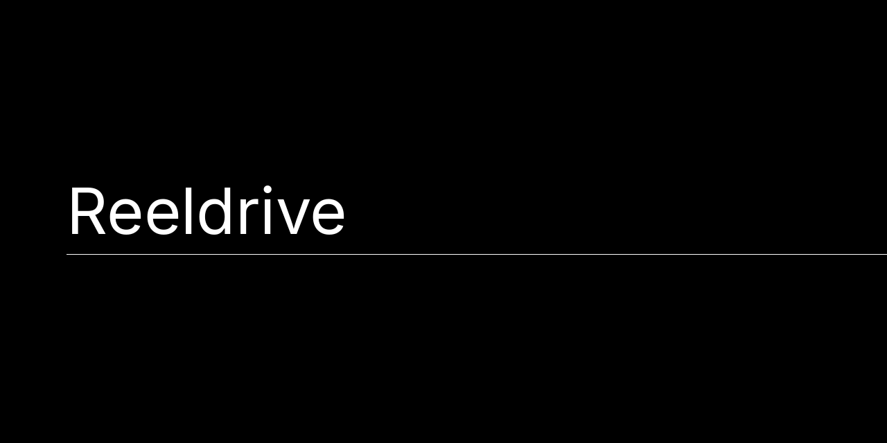

<p align="center">
  
</p>

<p align="center">
  <a href="https://t.me/reeldrivebot"><strong>@reeldrivebot</strong></a>
  · Python 3.13 · aiogram · FastAPI
</p>

# Reeldrive

Telegram bot for Instagram. Send a post or Reel. Connect a page. Download what that page is allowed to see.

**Download.** Paste a link. Posts, Reels, carousels, stories, highlights, and profile media go through HikerAPI. Three free direct-link downloads, then Pro.

**Connect.** `/connect` issues a code. DM it to the bridge Instagram account. After that the bot treats the page as yours — watchlist, feed, unfollowers.

**Advanced.** `/advancedconnect` opens a Mini App. Paste a `sessionid`. Reeldrive encrypts it and uses *your* session only for private following and stories that account already follows. The shared bridge session is never used for this. Passwords are not stored.

Also in chat: `following user` · `zip stories user` · `zip posts user` · `#tag` · `/search` · `/language`

The bot UI is English, Persian, and Arabic. Pro is Telegram Stars or a card receipt. Optional AI analysis of posts and uploaded video is Pro-gated. Admin dashboard and shop Mini App share one FastAPI app.

```bash
python3.13 -m venv .venv && source .venv/bin/activate
pip install -r requirements.txt
cp .env.example .env
python -m bot.main      # bot
python -m dashboard     # admin + Mini Apps, :8080
```

Do not commit tokens. If the bot token leaks, revoke it in BotFather.
